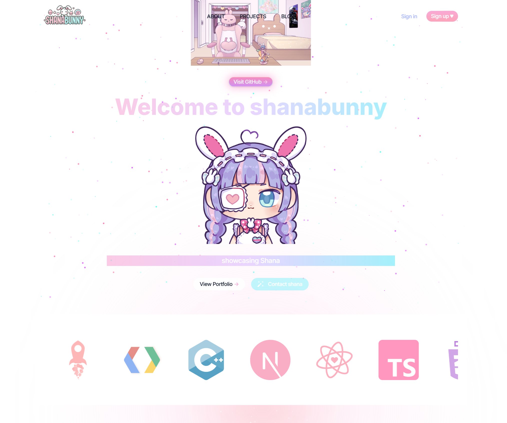

# ShanaWeb Platform

This is a full-stack monorepo for **ShanaWeb**, a web platform built with:

- **Next.js App Router (Frontend)** for UI and client-side logic.
- **Express + TypeScript + Routing-Controllers (Backend API Server)** for authentication, file storage, and music management.

---

## Features

### Frontend (Next.js - `shanabunny`)




- Built with **App Router** (from Next.js 13+).
- Routes include:
  - `/auth/signin`
  - `/auth/signup`
  - `/about`, `/blog`, `/music`, `/projects`, `/write`, `/edit`
- TailwindCSS & Lexical editor integration.
- Revalidation and action-based API integration under `src/actions`.

### Backend API (Express - `shanaapiserver`)

- Uses **`routing-controllers`** and **`typedi`** for modular, class-based routing.
- Core modules:
  - **AuthController**
    - `POST /signin`: Authenticate with JWT & API Key.
    - `POST /signup`: Register new users.
    - `GET /verify`: JWT token verification.
  - **FileController**
    - `GET /file/:id`: Retrieve stored files.
    - `POST /file/`: Upload general files.
    - `GET /file/music/list`: List music files.
    - `GET /file/music/:id`: Stream .mp3 music files.
    - `POST /file/music`: Upload .mp3 music files.
    - `DELETE /file/`: Delete by FileID.
- Middleware includes: `compression`, `body-parser`, CORS, and optional `express-rate-limit`.
- JWT, encrypted file access, and secure cookie storage.
- Requires API Key via headers and Token via cookies.

---

## 🐳 Docker Usage

Run both frontend and backend:

```bash
docker-compose up -d
```
